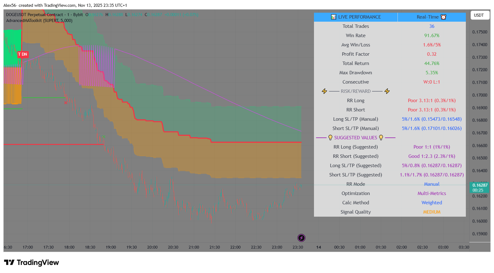
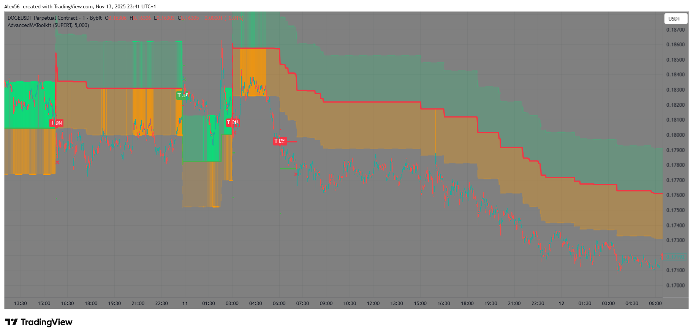
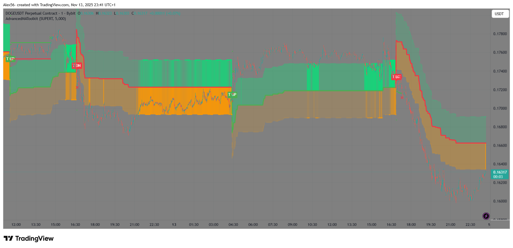
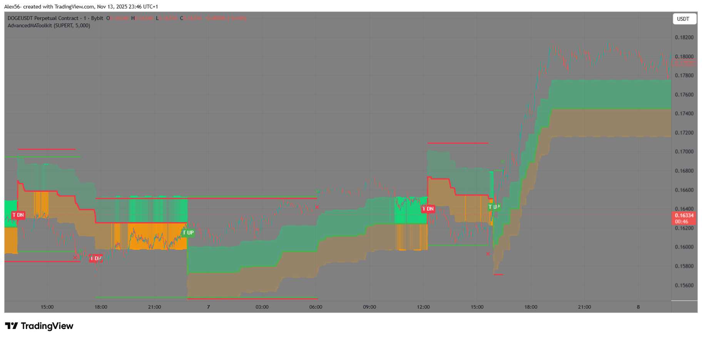
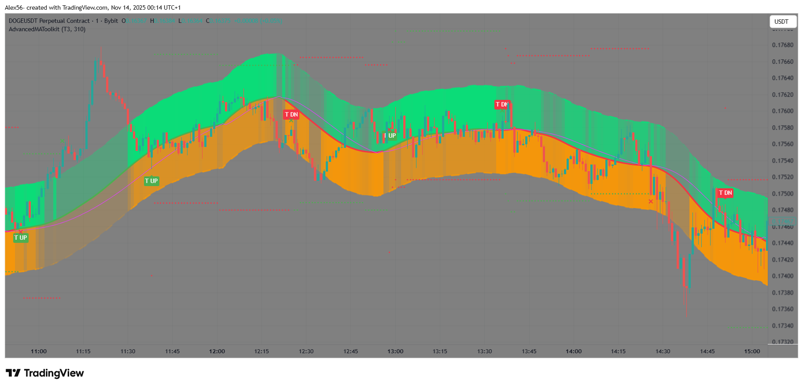
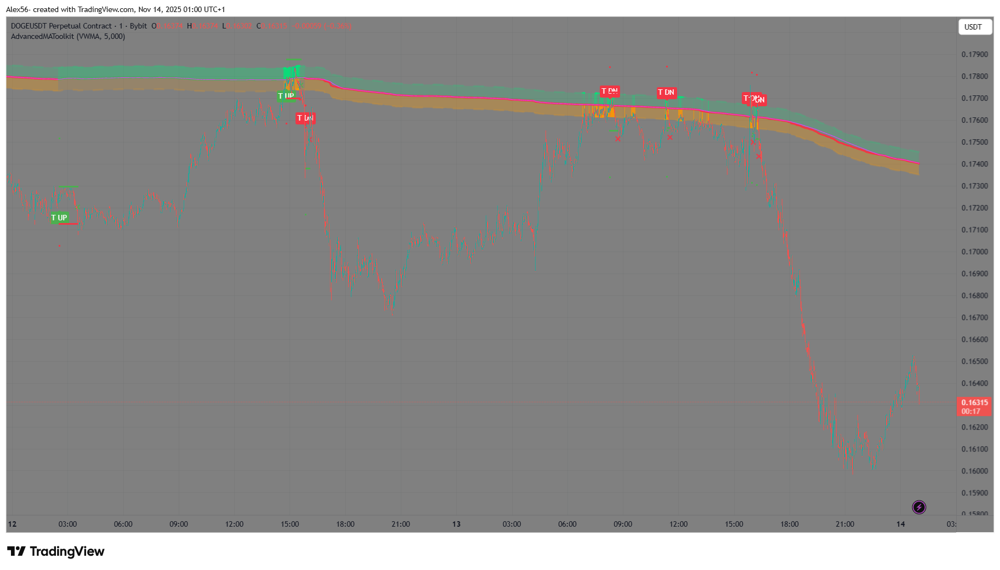
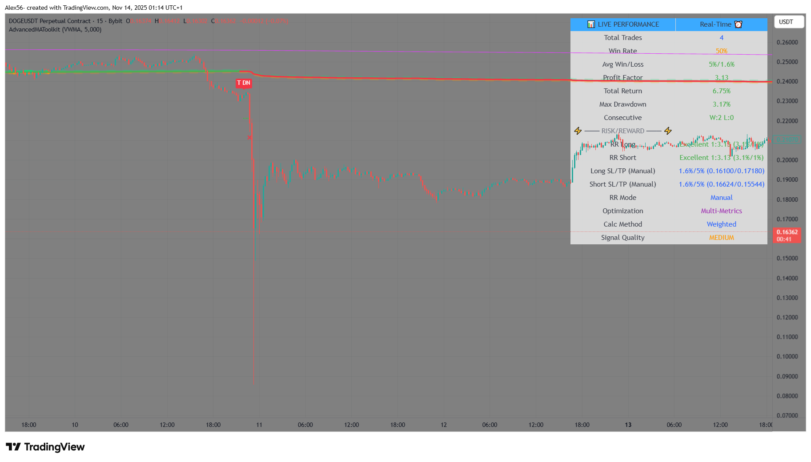

# AdvancedMA Toolkit – Complete Trading System
# with Auto-RR & Virtual Stats


> Pine Script v6 · 14 MA types Rotator · Dynamic period · Retest zones · Full filter stack · Auto-RR engine · Dual signals  
> Currently in **private** on TradingView fully accessible and usable for free from the links below

### TradingView Links
- Deep Dive Idea → [Take a look at the full ecosystem behind](https://www.tradingview.com/chart/XRPUSDT.P/odQITmXl/)
- Library → [AdvancedMAToolkit_Private](https://www.tradingview.com/script/7Qsnrj08-AdvancedMAToolkit-Private/)
- Indicator → [AdvancedMA_Toolkit_Private](https://www.tradingview.com/script/WrInRKvm/)

### Gallery (click to enlarge + arrows → to slide)
</img>
</img>
</img>
</img>
</img>
</img>
</img>
</img>

### Core Features
- 14 MA Types Rotator: Including T3, SuperTrend, FRAMA, HMA, ZLEMA, and more.
- Dynamic period + Linear Regression clamping
- Advanced retest zones (gradient + pending highlight)
- Filter stack: Momentum + 3×ZLEMA + Inside Bar / Engulfing patterns
- Statistics table with Auto-RR engine (Multi-Objective optimization)
- Dual signals: Main “UP/DN” labels + Table-driven “T UP / T DN”
- No-repaint mode · OCO / pyramiding / hedging modes

### Quick Import
```pinescript
import Simone_View/AdvancedMAToolkit_Private/1 as amt
```

### MQL4/5 Conversion · Custom Work
Full port or custom EA in 24-48h (€100–300)  
TradingView @Simone_View · GitHub @tuo-username


Open for freelance · DM on TradingView or here on GitHub
